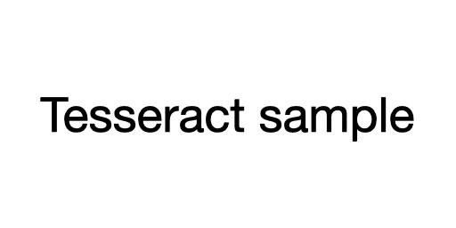
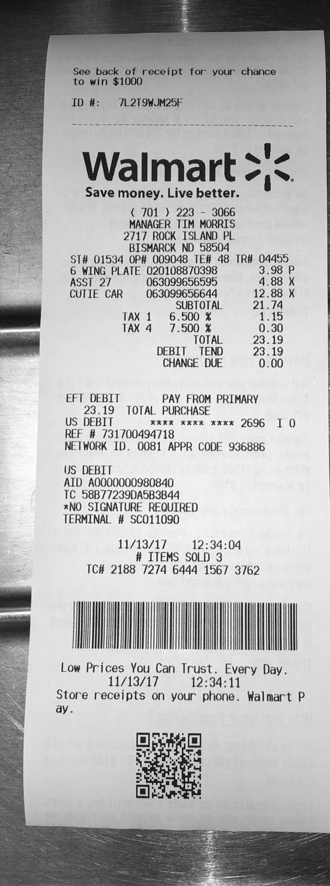
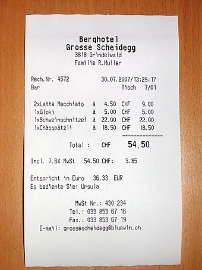
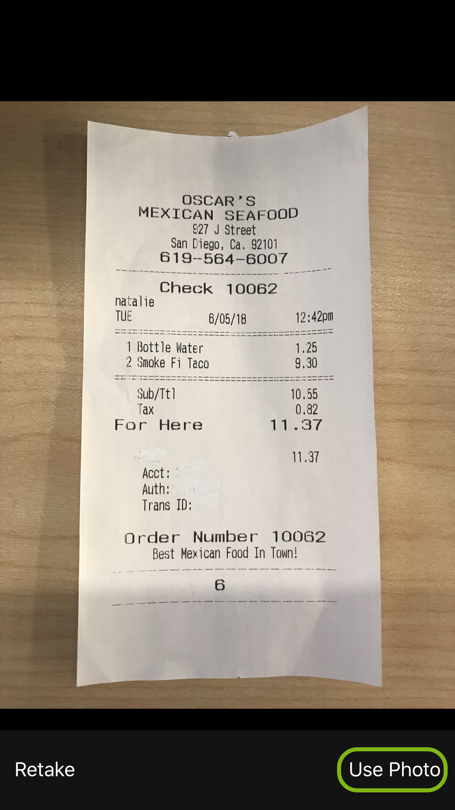
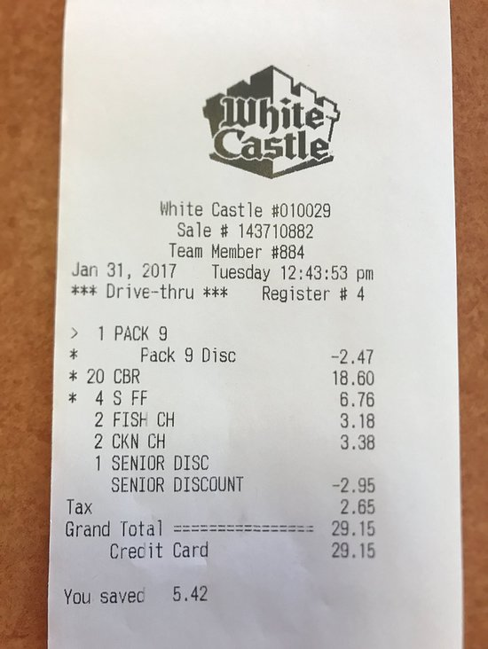
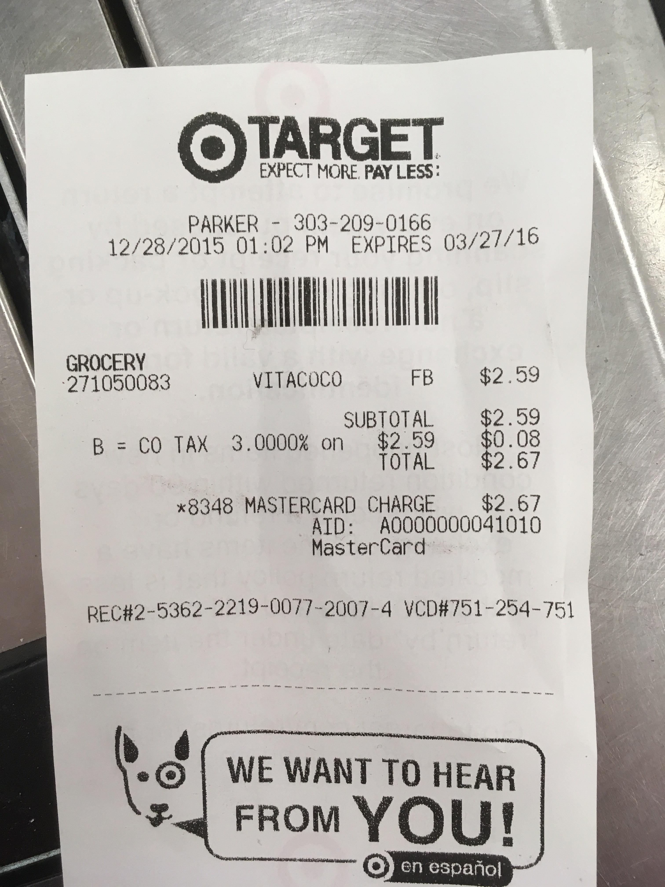

# ocr
Testing out optical character recognition (OCR) using [Tesseract](https://github.com/tesseract-ocr/tesseract) and Python.

## Installation of Tesseract
- To install on Windows, visit [this site](https://github.com/UB-Mannheim/tesseract/wiki).
This was the [specific installer](https://digi.bib.uni-mannheim.de/tesseract/tesseract-ocr-w64-setup-v5.0.1.20220118.exe) I used.
- Add the installation directory to your [path](https://stackoverflow.com/a/9546345).

## Testing Installation of Tesseract
Let's pass the following image through the OCR process.

- Run the following (in the root of the project):
```code
tesseract data/sample/input.jpg stdout
```
- You should get the following output:
```code
Tesseract sample
```

## Dependencies
Ensure you have an up-to-date Python version (mine was 3.10.2).

Install the following dependencies in your [virtual environment](https://www.jetbrains.com/help/pycharm/creating-virtual-environment.html):
- opencv-python
- pytesseract

## References
While getting started, I referenced [this](https://www.pyimagesearch.com/2021/08/16/installing-tesseract-pytesseract-and-python-ocr-packages-on-your-system/) as a guide.

## Current Test Results
### Receipt #1

```bash
See back of receip’
to win $1000
ID #: 7L2T9WJM25F

Walmart >/¢.

Save money. Live better.

( 701 ) 223 - 3066
MANAGER TIM MORRIS
2717 ROCK ISLAND PL
BISMARCK ND 58504
ST# 01534 OP# 009048 TE# 48 TRH 04455

6 WING PLATE 020108870398 3.98 P
ASST 27 063099656595 4.88 X
CUTIE CAR 063099656644 12.88 X

SUBTOTAL 21.74

TAX 1 6.500 % 1.15

TAX 4 7.500 %& 0.30

TOTAL 23.19
DEBIT TEND 23.19
CHANGE DUE 0.00

EFT DEBIT PAY FROM PRIMARY
23.19 TOTAL PURCHASE
US DEBIT xxKK xxKK xxxx 2696 I 0

REF # 731700494718
NETWORK ID. 0081 APPR CODE 936886

US DEBIT

AID A0000000980840

TC 58B77239DA5B3B44
*NO SIGNATURE REQUIRED
TERMINAL # SCO11090

11/13/17 12:34:04
# ITEMS SOLD 3
TC# 2188 7274 6444 1567 3762

MUA

ii Low Prices You Can Trust. Every Day.
| 11/13/17 12:34:11
Store receipts on your phone. Walmart P

= |
```
---

### Receipt #2

```bash
Berahotel
Grosse Scheidegg
3818 Grindeliald
Familie RM ler

Rechte, 4572
Bar
Dilatte Nacchtato
‘Gli
IySchveinschnitze!
Ihasopst214

Total: OF

Incl. 7.64 Ht 54.50 CHF:

Entspricht in Euro 26.93. EUR
Es bediente Ste: Ursula

Hust Nes: 480 234
Tel. : 033 653 67 16
Fax, : 033 858 67 19

E-nail: grosseachedeggtb luevin. ch
```
---
### Receipt #3

```bash
OSCAR’S
MEXICAN SEAFOOD
27 J Street
San Diego, Ca, 92101
619-56¢% 6007

Check 10062

natalie
TUE 6/05/18 a el
1 Bottle Hotere
a Snake FA Taco 9,30
“Sub/Tt 10.58
Tax 0,82
For Here lee Sv
11.37
Acct:
Auth:

Trans ID:

Order Number 10062
Best Mexican Food In Town!

6

Retake Use Photo
```
---
### Receipt #4

```bash
Cate

White Castle #010029
Sale # 143710882
Team Member #884
Jan 31, 2017 Tuesday 12:43:53 pm
*** Drive-thru *** Register # 4

> 1 PACK 9

* Pack 9 Disc 2.47
* 20 CBR 18.60
* 4S FF 6.76
2 FISH CH 3.18
2 CKN CH 3.38

1 SENIOR DISC
SENIOR DISCOUNT =2,95
2.65
= 29.15
Crecit Card 29.15

You savec 5.42
```
---
### Receipt #5

```bash
3) TARGET

EXPECT MORE. PAY LESS:

PARKER - 303-209-0166
12/28/2015 01:02 PM EXPIRES 03/2 7/16

NAC

271050083 —VITACOCO FB «$2.59

SUBTOTAL $2.59
B = CO TAX 3.0000% on $2.59 0.08

2.67
8348 MASTERCARD CHARGE $2.67
ATD: pee O0041010
MasterCard

“s
Re :
Cees 6.

RECH2-5362-2219-0077-2007-4 VCDH751-254-751 |

-@ ( WE WANT TO HEAR

FROM YOU!

@>yen espariol js
```
---